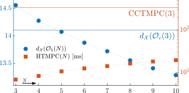
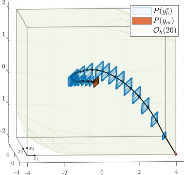

# Efficient Configuration-Constrained Tube MPC (CCTMPC) via Variable Restriction and Template Selection

This repository contains the MATLAB code necessary to implement the CCTMPC scheme described in our paper [[1]](#1). The scripts for generating the numerical examples are located in the `examples` folder.

## Examples

### Uncertain 3D Integrator (CTR Algorithm and Simulation)


### 10-State Quadrotor





## Software Requirements

The following software packages are required to run the code. Most of these tools offer free academic licenses.

- [CasADi](https://web.casadi.org/) – for IPOPT and OCP formulation via Opti.
- [DAQP](https://darnstrom.github.io/daqp/) – as the main QP solver for the tracking problem.
- [MPT3](https://www.mpt3.org/) – for the `Polyhedron` class methods and plotting.
- [Gurobi](https://www.gurobi.com/academia/academic-program-and-licenses/) (optional) – an alternative QP solver useful for higher-dimensional OCPs.

## Usage Instructions

Before running any of the examples, please ensure that the library paths are correctly configured on your system. Two classes of self-contained scripts are provided:

1. **CTR Example Scripts:**  
   The files named `CTR_example_*.m` implement Algorithm 1 from our paper. Upon execution, these scripts generate a candidate Configuration Triple \((F,E,V)\) of user-specified complexity that can be incorporated into the control schemes.

2. **Simulation Scripts:**  
   The files `Integrator3D.m` and `Quadrotor.m` generate simulation data for the Numerical Examples section of the paper. The resulting plots are automatically saved in the `figures` folder.

## Feedback and Contributions

If you find this package useful, please consider starring this repository as a token of appreciation. Contributions to the code are warmly welcomed! If you encounter any bugs or have suggestions for new features, please report them on the [issue page](https://github.com/fil-bad/EfficientCCTMPC/issues).

## Citing Our Work

If our work has contributed to your research, we kindly ask that you cite our paper:

### <a id="1">[1]</a> arXiv paper

```latex

```
